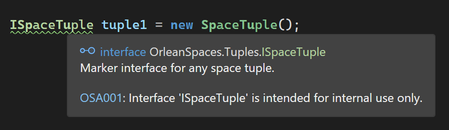
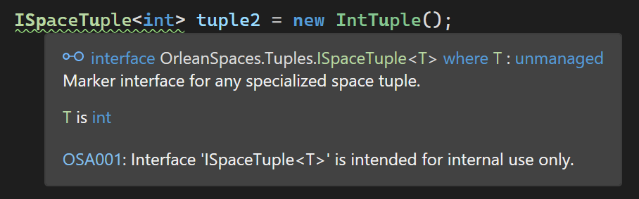
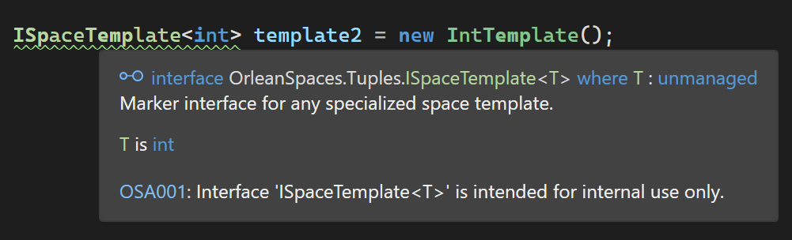

# OSA001

<table>
<tr>
  <td>Severity</td>
  <td>Warning</td>
</tr>
<tr>
  <td>Category</td>
  <td>Usage</td>
</tr>
</table>

## Title

Interface is intended for internal use only.

## Description

The interfaces `ISpaceTuple`, `ISpaceTemplate` and the generic versions `ISpaceTuple<T>`, `ISpaceTemplate<T>` are used by the internals of the library. They are not intended to be used, cast to<->from, and/or implemented by client code. 

Always use the concrete tuple/template types exposed by the library.

## Example

