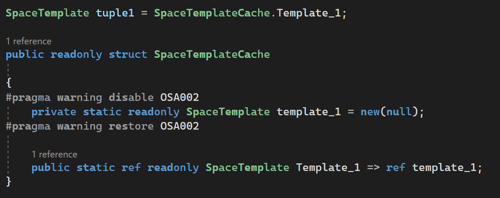

# OSA002

<table>
<tr>
  <td>Severity</td>
  <td>Info</td>
</tr>
<tr>
  <td>Category</td>
  <td>Performance</td>
</tr>
</table>

## Title

Avoid constructor instantiation having only `null` type, or no arguments.

## Description

Instantiation of a `SpaceTemplate` having only `null` type arguments (*or no arguments*) means that you care about tuples having that many fields, but don't care for the types, values, or indices. 

`SpaceTemplate template = new SpaceTemplate(null, null, null);`

The above results in the creation of an array of `object`s with 3 items, all of which are of type `null`. This results in unnecessary memory allocations.

Since an 'x-template' always has the same number of fields, one can and should reuse that (*via a read-only reference to an already initialized 'x-tuple' template*), in order to minimize memory allocations.

## Example

