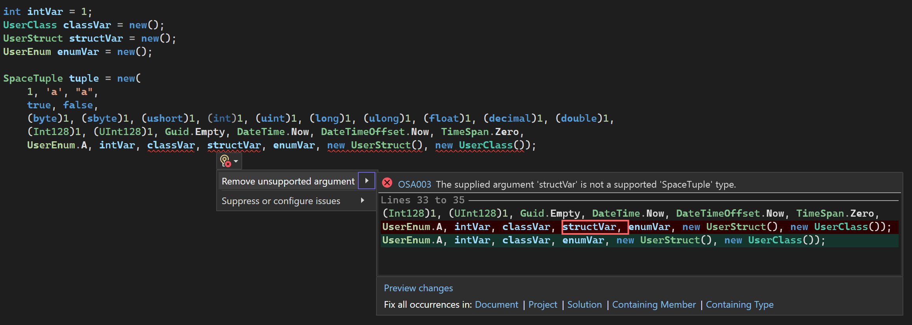
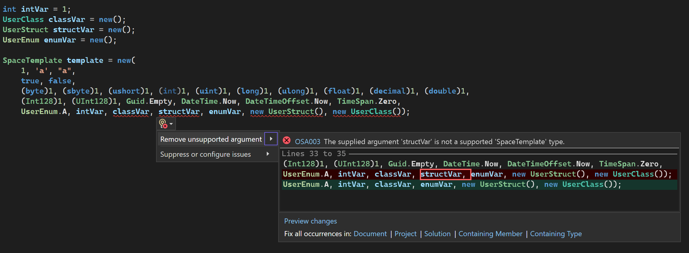

# OSA003

<table>
<tr>
  <td>Severity</td>
  <td>Error</td>
</tr>
<tr>
  <td>Category</td>
  <td>Usage</td>
</tr>
</table>

## Title

The supplied argument type is not supported.

## Description

When arguments passed to a `SpaceTuple` or `SpaceTemplate` are not supported field types, an `ArgumentException` is thrown during runtime. This analyzer detects such types which warns the user, and a respective code fixer is available to remove those invalid types.

## Example

