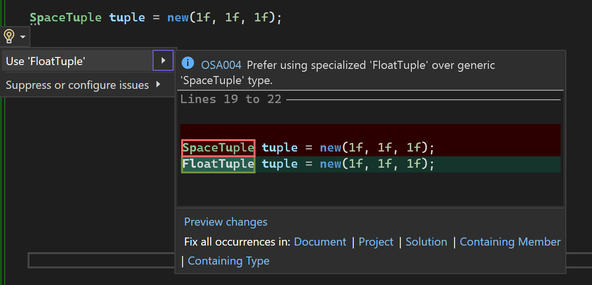
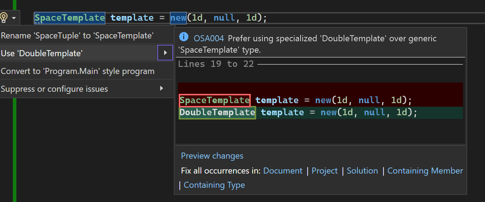

# OSA004

<table>
<tr>
  <td>Severity</td>
  <td>Info</td>
</tr>
<tr>
  <td>Category</td>
  <td>Performance</td>
</tr>
</table>

## Title

Prefer using specialized over generic type.

## Description

Instantiation of a `SpaceTuple` or `SpaceTemplate` having arguments of the same type should be avoided because there exists an appropriate tuple/template which is specialized for that type, and provides significant performance benefits. 

```
var tuple1 = new SpaceTuple(1, 2, 3);
SpaceTuple tuple2 = new(1f, 2f, 3f);
SpaceTuple tuple3 = new SpaceTuple(1d, 2d, 3d);

var template1 = new SpaceTemplate('a', null, 'b');
SpaceTemplate template2 = new(1m, null, 2m);
SpaceTemplate template3 = new SpaceTemplate(null, null, DateTime.MaxValue);
```

The analyzer will pick up all syntax types for instantiation (*traditional, simplified, and using 'var'*). Below is shown how the fixer converts them to their appropriate type.

```
var tuple1 = new IntTuple(1, 2, 3);
FloatTuple tuple2 = new(1f, 2f, 3f);
DoubleTuple tuple3 = new DoubleTuple(1d, 2d, 3d);

var template1 = new CharTemplate('a', null, 'b');
DecimalTemplate template2 = new(1m, null, 2m);
DateTimeTemplate template3 = new DateTimeTemplate(null, null, DateTime.MaxValue);
```

## Example


